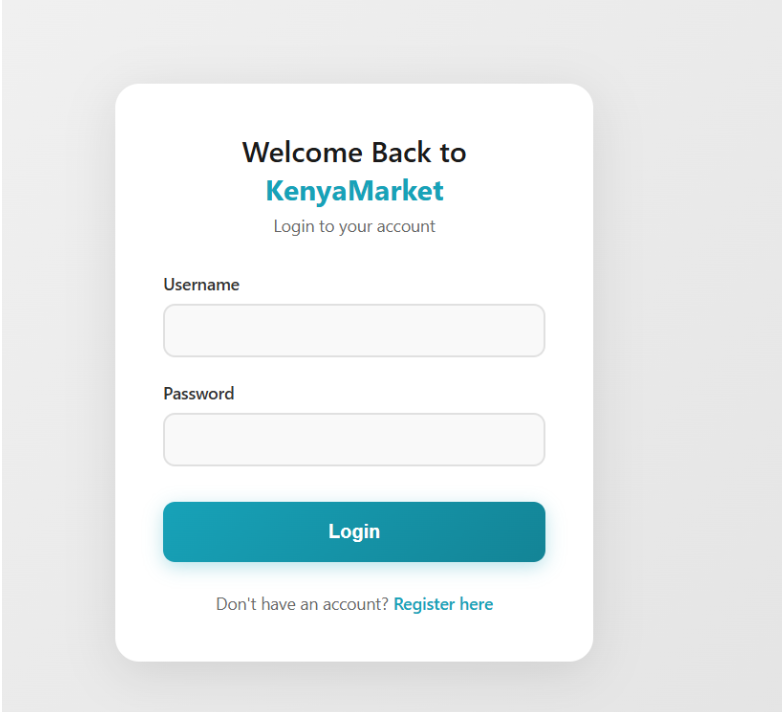
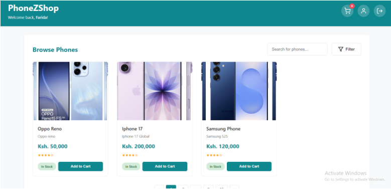

KenyaMarket is a Consumer-to-Consumer (C2C) e-commerce marketplace system designed specifically for the Kenyan digital economy. The platform addresses critical gaps in existing C2C platforms like Jiji, Facebook Marketplace, and Instagram-based trading by providing integrated transaction management, security features, and structured user interactions.

### Login Page



### Buyer Dashboard




Built using object-oriented software engineering principles, the system enables users to act as both buyers , sellers or both. Sellers can create profiles, list products with detailed information and images, and manage their inventory. Buyers can browse products across categories, search and filter listings, add items to cart, and complete transactions through multiple payment methods including M-Pesa, PayPal, and credit cards.

The architecture follows a three-tier model with distinct presentation, business logic, and data layers. Core OOP principles (abstraction, encapsulation, inheritance, polymorphism) are implemented throughout, along with SOLID design principles and established patterns including Singleton, Strategy, and State patterns. The system features comprehensive user authentication, role-based access control for buyers, sellers, and administrators, and maintains transaction history with state management.

```text
kenyamarket/
└── main/
    └── java/
        └── com/
            └── kenyamarket/
                ├── Main.java
                ├── controllers/
                │   ├── LoginController.java
                │   ├── PaymentController.java
                │   ├── ProductController.java
                │   └── RegistrationController.java
                ├── database/
                │   ├── DatabaseConnection.java
                │   ├── LoginService.java
                │   ├── ProductRepository.java
                │   └── UserRepository.java
                ├── filters/
                │   └── SessionFilter.java
                ├── models/
                │   ├── Admin.java
                │   ├── Buyer.java
                │   ├── LoginResult.java
                │   ├── Order.java
                │   ├── Product.java
                │   ├── ProductImage.java
                │   ├── Seller.java
                │   └── User.java
                ├── payments/
                │   ├── CreditCardPayment.java
                │   ├── MpesaPayment.java
                │   ├── PaymentStrategy.java
                │   ├── PayPalPayment.java
                │   └── ShoppingCart.java
                ├── states/
                └── utils/
                    └── SessionManager.java
```

Tech Stack
Backend: Java 17+ with Javalin framework
Frontend: HTML, CSS, JavaScript
Database: MySQL 8.0+
Build Tool: Maven
Runtime: Bun (for frontend asset management)
